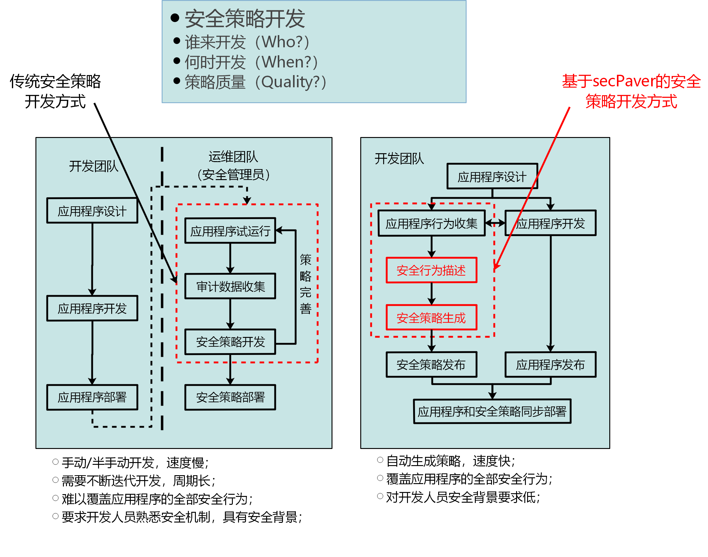
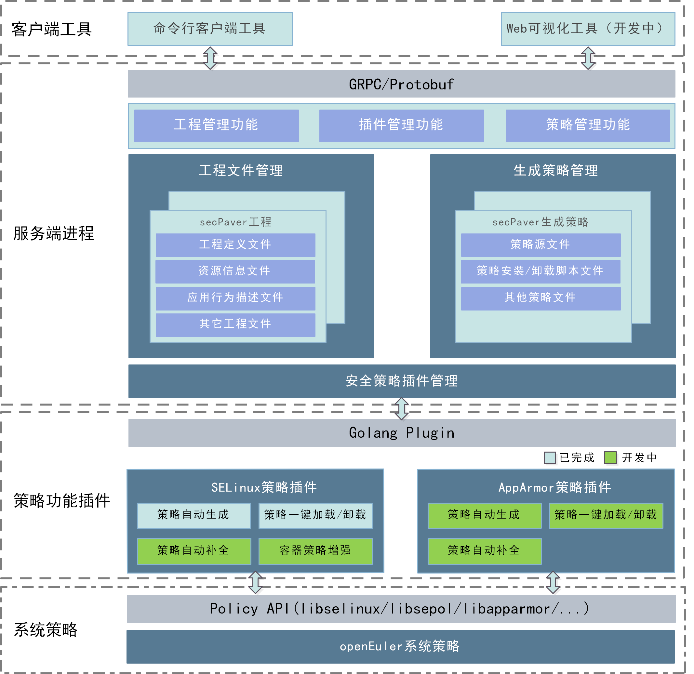
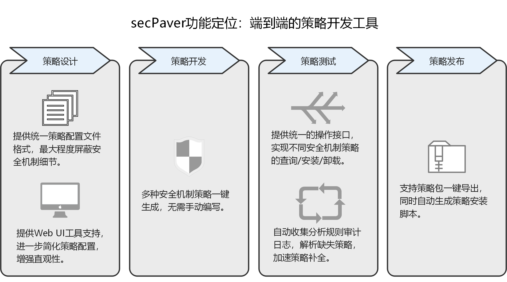

# secPaver用户手册

[TOC]

## 前言

本文档为secPaver基本介绍以及使用说明。

## 1 secPaver简介

### 1.1 背景和概述

在软件开发流程中，有一个重要环节：安全设计。即开发人员基于应用程序的数据流和控制流，为应用程序制定不同安全机制下契合其逻辑的安全规则，使应用程序在最小权限下运行。secPaver的作用是实现这一环节的自动化，只需开发者提供应用程序的行为描述即可直接生成不同安全机制下的策略文件，从而实现安全机制对开发者不感知，降低对开发者安全背景的要求。



### 1.2 软件架构

secPaver为客户端/服务端架构，客户端工具包括命令行工具pav和Web可视化工具（开发中），作用是为用户提供操作接口与交互界面；服务端为pavd进程，负责资源管理、策略生成等功能。secPaver支持多种安全机制，不同安全机制的功能实现封装为独立的插件，由服务端进程动态加载调用。



### 1.3 功能介绍

secPaver是一个支持多种安全机制的策略开发工具，目标是帮助用户实现端到端的安全策略开发，涵盖策略设计、迭代开发、策略发布等一些列流程步骤，提供策略配置、自动生成、运行测试、缺失规则补全、策略包导出等功能。secPaver最大的优点是向用户屏蔽了安全机制的细节，为不同安全机制抽象出统一的策略配置文件定义以及操作接口，以提升策略开发效率，降低开发人员的学习成本。



### 1.4 术语名词

**engine**：secPaver支持不同安全机制策略开发的功能模块，以插件的形式进行加载。

## 2 规格约束

- secPaver为安全策略的开发工具，用于在研发环境下生成安全策略，secPaver本身并不需要在现网环境中部署。
- secPaver目前只支持SELinux策略生成，支持的规则范围为文件、capability和网络socket，在生成相应规则的时候，也需要遵循SELinux相关的约束。
- secPaver仅支持基于openEuler SELinux的targeted策略类型生成SELinux策略，不支持minimum和mls策略类型。
- SELinux为白名单模式的强制访问控制机制。如果应用程序的安全策略配置有误，可能会导致应用程序无法正常运行。用户需要在测试环境中进行完善的验证后，才能将策略在生产环境中部署。
- secPaver只允许以root权限使用，用户在通过root权限使用secPaver时，需要自行做好安全措施（如避免直接使用root用户远程登录等）。
- secPaver做的是在已有策略的基础上添加安全策略，而不能修改或取消原有的规则（非secPaver生成的规则），同时，secPaver在生成策略时也会默认放开一部分权限，因此可能存在实际权限大于用户配置权限的情况。
- 使用secPaver生成SELinux策略中包含跨文件系统的文件资源时，可能由于文件系统属性以及SELinux配置导致规则无法生效，此时需要用户根据SELinux原生的策略开发流程，手动编写规则。
- secPaver基于当前系统的SELinux配置生成SELinux安全策略，因此要求策略实际部署环境的SELinux配置与策略开发环境相同，否则可能会导致策略部署失败。
- SELinux策略部署、卸载、补全等流程与实际的应用环境密切相关，secPaver生成策略时提供的脚本程序仅满足基本功能，脚本程序的具体使用或定制开发需要用户自行保障。
- secPaver当前不支持并发操作，当服务端接收到多条客户端请求时，同一时刻只处理一条请求，其余请求会发生阻塞。

## 3 安装与部署

### 3.1 软件安装

**(1) 安装依赖软件包**

编译secPaver需要的软件有：
* make
* golang 1.11+

编译SELinux策略插件需要的软件有：
* libselinux-devel 2.9+
* libsepol-devel 2.9+
* libsemanage-devel 2.9+

运行SELinux策略插件需要的软件有：
* libselinux 2.9+
* libsepol 2.9+
* libsemanage 2.9+
* checkpolicy 2.8+
* policycoreutils 2.8+

**(2) 下载源码**
```
git clone https://gitee.com/openeuler/secpaver.git
```

**(3) 编译安装**

```
cd secpaver
make
```
编译SELinux策略插件：
```
make selinux
```
安装软件（至少一个策略插件需要被编译）：
```
make install
```

### 3.2 服务端配置

secPaver服务端程序pavd需要指定配置文件才能启动，默认配置文件为/etc/secpaver/pavd/config.json，也可以通过命令行指定其他路径的配置文件，配置文件的格式为json，配置项为：

| 一级配置项 | 二级配置项  | 三级配置项 |  类型  |                           说明                           |
| :--------: | :---------: | ---------- | :----: | :------------------------------------------------------: |
|  connect   |    grpc     | socket     | string |            grpc通信使用的unix socket文件路径             |
| repository |  projects   | N/A        | string |                 服务端存储工程文件的目录                 |
|            |   policies   | N/A        | string |          服务端存储策略文件的目录          |
|    log     |    path     | N/A        | string |                     日志文件存放路径                     |
|            |    level    | N/A        | string | 日志输出等级，可选debug、info、warn、error、fatal或panic |
|            | maxFileSize | N/A        |  uint  |              最大单个日志文件大小，单位为MB              |
|            | maxFileNum  | N/A        |  uint  |                     最大日志文件个数                     |
|            | maxFileAge  | N/A        |  uint  |                最大日志保存时间，单位为天                |

服务端配置文件示例：

```json
{
    "connect": {
        "grpc":{
            "socket":"/var/run/secpaver/pavd.sock"
        }
    },
    "repository": {
        "projects": "/var/local/secpaver/projects",
        "policies": "/var/local/secpaver/policies"
    },
    "log":{
        "path":"/var/log/secpaver/pavd.log",
        "level":"debug",
        "maxFileSize": 10,
        "maxFileNum": 20,
        "maxFileAge": 30
    }
}
```

### 3.3 服务端启动

使用如下命令启动secPaver服务端程序：
```
systemctl start pavd
```

使用如下命令停止服务端程序运行：

```
systemctl stop pavd
```

### 3.4 策略生成插件加载

服务端启动后从/usr/lib64/secpaver/目录下寻找策略生成插件并加载，插件命名为<策略机制.so>，如selinux.so。至少加载一个策略生成插件，服务端才能正常启动。

## 4 工程文件格式说明

secPaver根据工程文件生成策略，一个工程定义了一组应用程序的权限信息，本章节介绍secPaver工程结构和编写语法。

### 4.1 工程及工程文件命名
secPaver工程名以及工程中各文件名可包含字母、数字、小数点、下划线和中划线，且只能以字母或下划线开头。

### 4.2 工程定义文件

secPaver工程中必须存在名为pav.proj的工程定义文件，且需放置在工程根目录下，在该文件中对工程的基本信息和文件进行定义。文件格式为json，内容说明如下表：

| 一级配置项 | 二级配置项 |     类型     |   属性   |              说明               |
| :--------: | :--------: | :----------: | :------: | :-----------------------------: |
|    name    |    N/A     |    string    | required |            工程名称             |
|    ver     |    N/A     |    string    | required |           工程版本号            |
| resources  |    N/A     |    string    | required |      资源信息文件相对路径       |
|   specs    |    N/A     | string array | required |        spec文件相对路径         |
|  selinux   |   config   |    string    | required | SELinux策略生成配置文件相对路径 |

**注意：pav.proj文件中定义工程文件结构的字段值为各文件相对工程根目录的相对路径，且必须在工程目录下，路径中不可出现“../”。**

工程定义文件示例：
```json
{
    "version": "3",
    "name": "secpaver",
    "resources": "resources.json",
    "specs": [
        "specs/module_pavd.json",
        "specs/module_pav.json"
    ],
    "selinux": {
		"config": "selinux.json"
	}
}
```

### 4.3 资源信息文件

secPaver生成安全策略包含的全部文件资源信息（包括应用程序文件和应用程序访问的文件资源）都需要在该文件中定义，工程中必须存在且只能存在一个资源信息文件。格式为json文件，建议命名为“resources.json”。定义文件信息的字段及说明如下。

|    一级配置项  | 二级配置项 | 三级配置项 |  类型  |   属性   |               说明              |
| :-----------: | :------: | :----: | :------: | :---------------------------: | ------------- |
| resourceList |   type   | N/A | string | required |   文件资源类型（详见4.3.1）    |
|               |   path   | N/A | string | required |   文件资源路径（详见4.3.2）    |
| | extended | N/A | string | optional | 文件资源的扩展属性（暂不使用） |
| | selinux | isSysFile | bool | required | SELinux策略生成有效，表示该文件是否为系统公共文件资源。如果设置为true，则继承系统默认安全上下文，否则使用用户定义的安全上下文或自动生成安全上下文。 |
|               |            | isPrivateFile | bool   | required |      SELinux策略生成有效，isSysFile为false才可设置该项，如果设置为true，则定义文件的SELinux type时不关联file_type属性，否则关联file_type属性。根据file_type属性配置的基础策略不同，可能影响其他进程对该文件的访问权限      |
| |            | type          | string | optional |   自定义文件的SELinux type，isSysFile为false才可设置该项   |
| |            | domain        | string | optional | 自定义文件被执行后进程的SELinux type，isSysFile为false才可设置该项 |

**注意：**

**1) 对于策略主体应用程序，不可指定isSysFile为true；**

**2) isSysFile和isPrivateFile字段不可同时为true。**

#### 4.3.1 文件资源类型

secPaver的文件类型关键字如下表，若输入为空，表示该路径对应的全部文件类型（与all相同）：

|   类型    |          说明          |
| :-------: | :--------------------: |
|    all    |      全部文件类型      |
|   file    |        普通文件        |
| sock_file |       套接字文件       |
| lnk_file  |        链接文件        |
| fifo_file |        管道文件        |
| chr_file  |      字符设备文件      |
| blk_file  |       块设备文件       |
|    dir    |        目录文件        |
| exec_file | 可执行文件（普通文件） |

#### 4.3.2 文件路径

文件路径必须为绝对路径，且相同文件路径只能定义一次；路径中可以使用通配符，但由于不同安全机制下的文件路径表示存在差异（如AppArmor使用通配符，而SELinux使用正则表达式），目前对用户允许使用的通配符做了一定限制：

**(1) 在文件路径末使用通配符**

|  路径表示  |                             说明                             |
| :--------: | :----------------------------------------------------------: |
|   /dir/*   | dir目录下的所有文件，不包含子目录下的文件，不包含dir目录本身。 |
|  /dir/**   |      dir目录及其子目录下的所有文件，不包含dir目录本身。      |
| /dir{,/*}  | dir目录下的所有文件，不包含子目录下的文件，包含dir目录本身。 |
| /dir{,/**} |       dir目录及其子目录下的所有文件，包含dir目录本身。       |

**(2) 在文件路径中使用通配符**

| 通配符 |             说明             |
| :----: | :--------------------------: |
|   *    | 表示0个或多个除"/"以外的字符 |
|   ?    |    表示1个除"/"以外的字符    |

**(3) 用户需要转义的特殊字符**

```
* ? { } \
```

#### 4.3.3 宏定义

用户可以使用宏简化文件路径书写，宏需要在资源信息文件中进行定义。宏名称需要符合C语言命名规范，即可包含字母、数字和下划线，且不能以数字开头。建议使用大写字母，如BIN_DIR、WORK_DIR等。

|  配置项   | 子配置项 |  类型  |   属性   |  说明  |
| :-------: | :------: | :----: | :------: | :----: |
| macroList |   name   | string | required | 宏名称 |
|           |  value   | string | required |  宏值  |

在资源路径中使用“$()”包裹宏名使用宏，如$(BIN_DIR)/pav、$(WORK_DIR)/project等。

#### 4.3.4 资源组

对于一些具有相同权限的文件资源，用户可以添加到一个资源组进行管理，在spec文件中可以直接通过引用资源组来引用这些文件资源，方便书写且增强可读性。资源组中的资源路径必须在“resourceList”中存在定义。

|  配置项   | 子配置项  |     类型     |   属性   |      说明      |
| :-------: | :-------: | :----------: | :------: | :------------: |
| groupList |   name    |    string    | required |   资源组名称   |
|           | resources | string array | required | 资源组路径信息 |

**注意：资源组的命名要求和使用方法和宏相同，两者共享一个命名空间，不能重名。**

#### 4.3.5 资源信息文件示例

```json
{
    "macroList": [
        {
            "name": "VSEC_PROJDIR",
            "value": "/root/pavprojects"
        }
    ],
    "groupList": [
        {
            "name": "MANAGE_GROUP",
            "resources": [
                "/var/run/secpaver{,/**}",
                "/var/log/secpaver{,/**}",
                "/var/local/secpaver{,/**}",
                "/tmp/secpaver{,/**}"
            ]
        }
    ],
    "resourceList": [
        {
            "type": "",
            "path": "/var/run/secpaver{,/**}",
            "selinux": {
				"isSysFile": false,
				"isPrivateFile": false,
				"type": "pavd_run_t"
			}
        },
        {
            "type": "",
            "path": "$(VSEC_PROJDIR){,/**}",
            "selinux": {
				"isSysFile": false,
				"isPrivateFile": false
			}
        },
        {
            "type": "",
            "path": "/tmp/secpaver{,/**}",
            "selinux": {
				"isSysFile": false,
				"isPrivateFile": false,
				"type":"pavd_tmp_t"
			}
        },
        {
            "type": "exec_file",
            "path": "/usr/bin/make",
            "selinux": {
				"isSysFile": true,
				"isPrivateFile": false
			}
        },
        {
            "type": "file",
            "path": "/usr/share/selinux/devel/Makefile",
            "selinux": {
				"isSysFile": true,
				"isPrivateFile": false
			}
        },
        {
            "type": "",
            "path": "/var/local/secpaver{,/**}",
            "selinux": {
				"isSysFile": false,
				"isPrivateFile": false,
				"type": "pavd_local_t"
			}
        },
        {
            "type": "",
            "path": "/etc/secpaver{,/**}",
            "selinux": {
				"isSysFile": false,
				"isPrivateFile": false,
				"type": "pavd_etc_t"
			}
        },
        {
            "type": "",
            "path": "/var/log/secpaver{,/**}",
            "selinux": {
				"isSysFile": false,
				"isPrivateFile": false,
				"type": "pavd_log_t"
			}
        },
        {
            "type": "exec_file",
            "path": "/usr/bin/pavd",
            "selinux": {
				"isSysFile": false,
				"isPrivateFile": false,
				"type": "pavd_exec_t",
				"domain": "pavd_t"
			}
        },
        {
            "type": "exec_file",
            "path": "/usr/bin/pav",
            "selinux": {
				"isSysFile": false,
				"isPrivateFile": false,
				"type": "pav_exec_t",
				"domain": "pav_t"
			}
        }
    ]
}
```

### 4.4 应用程序权限定义文件

应用程序权限定义文件用来声明工程中各个应用程序的行为权限，相关配置字段如下：

|     配置项      |    子配置项    |     类型     |   属性   |             说明              |
| :-------------: | :------------: | :----------: | :------: | :---------------------------: |
| applicationList |  application   |    struct    | required |   应用程序信息（详见4.4.1）   |
|                 | permissionList | struct array | required | 应用程序权限描述（详见4.4.2） |

#### 4.4.1 应用程序信息

|   配置项    |   子配置项   |     类型     |   属性   |                       说明                       |
| :---------: | :----------: | :----------: | :------: | :----------------------------------------------: |
| application |     path     |    string    | required |                   应用程序路径                   |
|             | isPermissive |     bool     | required |          是否将该进程设为permissive模式          |
|             | isUnconfined |     bool     | required |          是否将该进程设为unconfined模式          |

**注意：**

**1) 应用程序的路径必须为绝对路径，且需要在资源信息文件中存在定义。**

#### 4.4.2 应用程序权限描述

|     配置项     | 子配置项  |     类型     |   属性   |                           说明                            |
| :------------: | :-------: | :----------: | :------: | :-------------------------------------------------------: |
| permissionList |   type    |    string    | required | 权限类型，目前支持filesystem、capability和network |
|                | resources | string array | required |                  应用程序访问的资源列表                   |
|                |  actions  | string array | required |                 应用程序对资源的权限行为                  |

不同权限类型对应的字段配置说明如下：

|     权限类型     |    type    |    resources     |    actions     |              关键字说明               |           备注           |
| :--------------: | :--------: | :--------------: | :------------: | :-----------------------------------: | :----------------------: |
|     文件权限     | filesystem | 文件路径或资源组 |  文件操作权限  |     [文件权限关键字](sub/file.md)     |                          |
|  capability权限  | capability |     无需填写     | capability类型 | [capability关键字](sub/capability.md) |                          |
|     网络权限     |  network   |     网络资源     |  网络资源权限  |   [网络资源关键字](sub/network.md)    |                          |

#### 4.4.3 spec文件示例

```
{
    "applicationList":[
        {
            "application":{
                "path":"/usr/bin/pavd"
            },
            "permissionList":[
                {
                    "type":"filesystem",
                    "resources":[
                        "$(WORK_GROUP)"
                    ],
                    "actions":[
                        "read",
                        "write"
                    ]
                },
                {
                    "type":"capablilty",
                    "actions":[
                        "setuid",
                        "net_raw"
                    ]
                },
                {
                    "type":"network",
                    "resources":[
                        "domain:inet,type:stream,protocol:tcp,port:55000"
                    ],
                    "actions":[
                    	"connect",
                    	"send"
                    ]
                },
            ]
        }
    ]
}
```

### 4.5 策略生成配置文件说明

#### 4.5.1 SELinux策略配置文件说明

SELinux策略生成配置文件格式为json文件，建议命名为selinux.json。字段定义为：

|   配置项   | 子配置项   |   属性   |     类型     |                             说明                             |
| :--------: | ---------- | :------: | :----------: | :----------------------------------------------------------: |
| extraRules | N/A        | optional | string array |                    额外添加的SELinux规则                     |
|   policy   | monolithic | required |     bool     | 策略生成模式，若设置为true，生成一个策略模块；若设置为false，则生成多个子策略模块和一个public策略模块（详见6.1.1） |

#### 4.5.3 SELinux策略配置文件示例

```
{
	"policy":{
		"monolithic_policy": true
	},
	"extraRules":[
		"allow pav_t sysfs_t:file { open read };",
		"allow pavd_t user_devpts_t:chr_file { append read write };"
	]
}
```

## 6 策略文件说明

本章对secPaver生成的策略文件进行说明。

### 6.1 SELinux策略文件

#### 6.1.1 策略模块

SELinux的策略以模块形式进行管理，一个策略模块中包含文件安全上下文的声明和安全规则的定义。根据SELinux配置文件中monolithic配置项的不同配置，生成策略模块也不相同：

| monolithic | 说明                                                         |
| ---------- | ------------------------------------------------------------ |
| false      | 生成一个以“<工程名>\_public”命名的策略模块，提供公共的SELinux类型定义和安全上下文定义。同时以spec文件为单位生成若干以“<工程名>\_<spec名>”命名的策略子模块，分别实现各个spec文件中定义的安全规则。 |
| true       | 只生成一个以工程名命名的策略模块，包含全部策略信息。             |

secPaver生成的策略模块标识会在模块名后追加“\_selinux”标识，示例：

生成多个策略模块：
```
# ls specs/
module_1.json  module_2.json  module_3.json
# pav policy list

Name                                  Status     
demo_module_1_selinux                 disable    
demo_module_2_selinux                 disable    
demo_module_3_selinux                 disable    
demo_public_selinux                   disable  
```
生成单个策略模块：
```
# pav policy list

Name                                  Status     
demo_selinux                          disable    
```

**注意：**
**1) 一般而言，生成多个策略模块的方式适合策略调试，或部分策略需要动态加载卸载的场景，而生成一个策略模块的方式适合应用程序配套策略发布，或实际部署的场景。**

**2) 生成多个策略模块的策略时，策略子模块会依赖public模块，因此在加载策略时，需要遵循先加载public模块，再加载子模块的顺序，卸载策略则相反。**

#### 6.1.2 脚本文件生成

在生成策略时，secPaver会在策略目录下生成若干脚本文件，封装了用户生成、部署策略等常用操作：

| 脚本文件          | 说明                                                         |
| ----------------- | ------------------------------------------------------------ |
| install.sh        | 将策略目录下全部策略模块加载到系统中（有同名策略会卸载），并刷新模块使用的文件资源的安全上下文。 |
| uninstall.sh      | 卸载系统中已加载的策略目录下的策略模块，并刷新模块使用的文件资源的安全上下文。 |
| update.sh         | 用户手动修改策略的te或fc文件后，重新编译策略模块。           |
| audit.sh          | 使用audit2allow工具分析audit日志并导出与工程相关的规则。     |
| restorecon.sh     | 使用restorecon命令刷新策略模块使用的文件资源的安全上下文。     |

默认的脚本文件存放在在/usr/share/secpaver目录下，用户可以自行进行修改定制。

**注意：SELinux策略的操作过程比较复杂，涉及安全上下文的变更，根据产品应用环境的不同，实际部署的方案可能会有差异，因此secPaver提供的脚本仅供参考使用。**

## 7 LICENSE

secPaver项目文档使用的协议为[BY-SA 4.0](LICENSE)。

