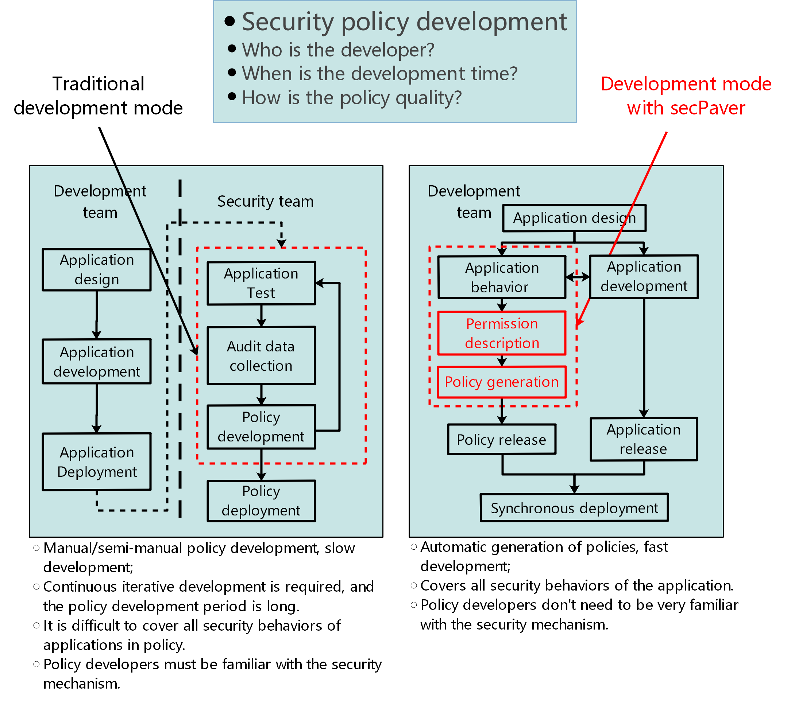
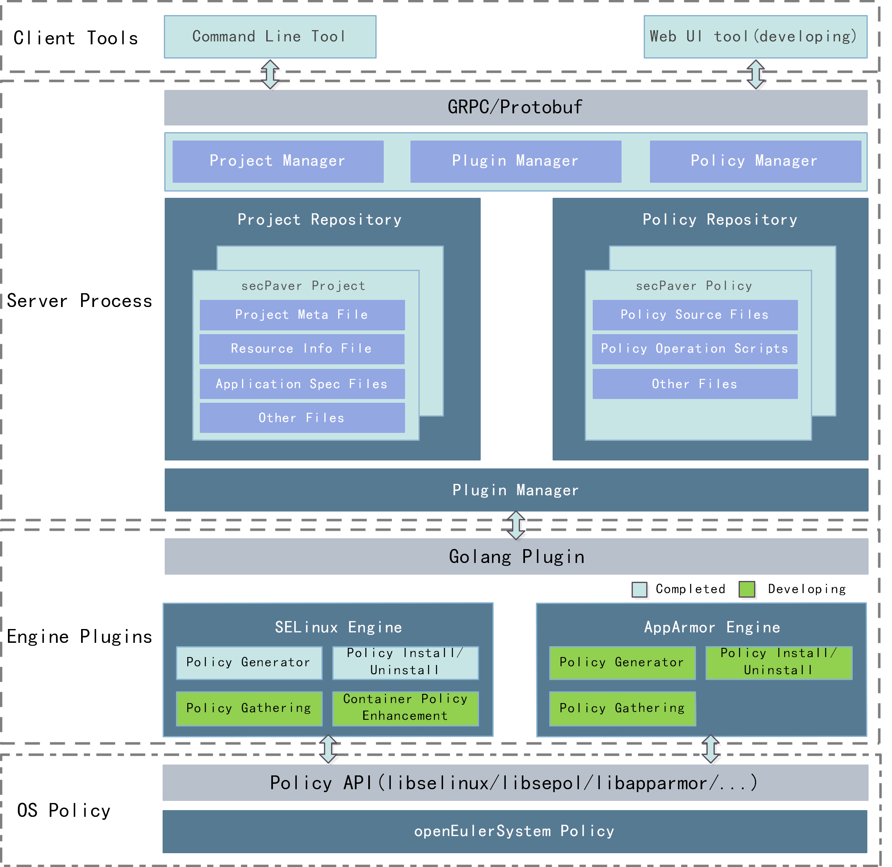
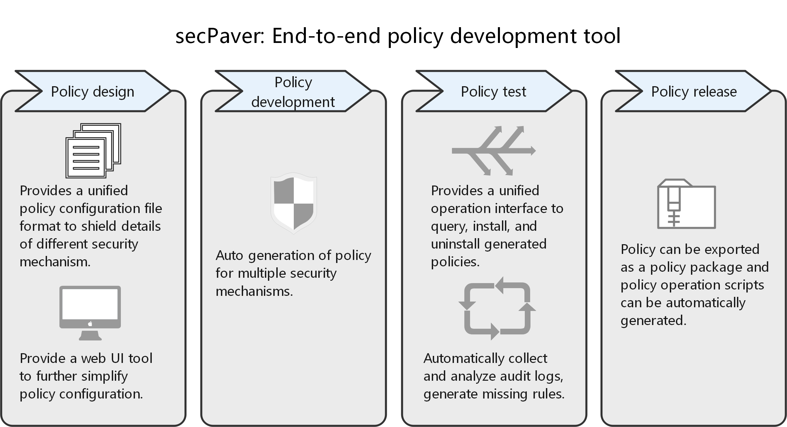

# secPaver User Manual

[TOC]

## Perface

This document describes how to use secPaver.

## 1 Introduction

### 1.1 Background

Security design is an very important step in the software development. In order to meet the principle of least privilege, developers make rules for applications based on data flow and control flow of processes. This step can be automated with secPaver. With the permission description of application, secPaver can generate security policy for different security mechanisms. By this way, security design can be simplified, and developers do not need to know many details about security mechanisms.



### 1.2 Software Architecture

secPaver is a client/server architecture. The client tools include the command-line tool pav and web visualization tool (under development). The client tools are used to provide operation interfaces for users. The pavd server process manages data resources and generates policies. The secPaver supports multiple security mechanisms. Functions of different security mechanisms are encapsulated as independent plugins, which are dynamically loaded and invoked by server processes.



### 1.3 Function

secPaver is a policy development tool that supports multiple security mechanisms. It aims to help users implement end-to-end security policy development, including policy design, iterative development, and policy release. It provides functions such as policy configuration, automatic generation, running test, missing rule gathering, and policy package export. secPaver shields security mechanism details and abstracts unified policy configuration file definitions and operation interfaces for different security mechanisms, improving policy development efficiency and reducing learning costs for developers.



### 1.4 Terms

**engine**: Function modules supported by secPaver for different security mechanism, loaded as a plugin. secPaver Currently supports SELinux engine.

## 2 Specification Constraints

- secPaver is a security policy development tool used to generate security policies in the R&D environment. secPaver itself does not need to be deployed in the live network environment.
- secPaver currently only supports SELinux policy generation, and the range of supported rules is file, capability and network socket.
- secPaver only supports generating SELinux policies based on the targeted policy type of openEuler SELinux, and does not support minimum and mls policy types. When generating policy, it is also necessary to follow SELinux-related constraints.
- SELinux is a mandatory access control mechanism in whitelist mode. If the security policy of the application is configured incorrectly, the application may not run normally. Users need to perform complete verification in the test environment before deploying the strategy in the production environment.
- secPaver is only allowed to be used with root privileges. When using secPaver with root privileges, users need to take security measures by themselves (such as avoiding directly using root users to log in remotely, etc.).
- What secPaver does is to add security policies on the basis of existing policies, and cannot modify or cancel the original rules (rules not generated by secPaver). At the same time, secPaver will also release some permissions by default when generating policies, so it may There are cases where the actual authority is greater than the user configuration authority.
- When using secPaver to generate file resources that include cross-file systems in an SELinux policy, the rules may not take effect due to file system attributes and SELinux configuration. At this time, the user needs to manually write the rules according to the SELinux native policy development process.
- secPaver generates the SELinux security policy based on the SELinux configuration of the current system. Therefore, the SELinux configuration of the actual deployment environment of the policy is required to be the same as the policy development environment, otherwise the policy deployment may fail.
- SELinux strategy deployment, uninstallation, completion and other processes are closely related to the actual application environment. The script program provided by secPaver when generating the strategy only meets the basic functions, and the specific use or customized development of the script program needs to be guaranteed by the user.
- secPaver currently does not support concurrent operations. When the server receives multiple client requests, only one request is processed at the same time, and the remaining requests will be blocked.

## 3 Installation and Deployment

### 3.1 Installation

**(1) Dependency packages**

To build secPaver, the following packages are required:
* make
* golang 1.11+

To build SELinux engine plugin, the following packages are also required:
* libselinux-devel 2.9+
* libsepol-devel 2.9+
* libsemanage-devel 2.9+

To run SELinux engine plugin, the following packages are required:
* libselinux 2.9+
* libsepol 2.9+
* libsemanage 2.9+
* checkpolicy 2.8+
* policycoreutils 2.8+

**(2) Download source code**
```
git clone https://gitee.com/openeuler/secpaver.git
```

**(3) Build and install**
```
cd secpaver
make
```
Build SELinux engine plugin:
```
make selinux
```
Install (after at least one engine plugin is built):
```
make install
```

### 3.2 Server Configuration

The server config file should be specified when the secPaver server starts. The default file path is /etc/secpaver/pavd/config.json. Other path can also be specified by command line. The file format is JSON and the fields are follows:

|   Field    |  Sub-field  | Sub-field |  Type  |                    Description                    |
| :--------: | :---------: | --------- | :----: | :-----------------------------------------------: |
|  connect   |    grpc     | socket    | string |            Grpc unix socket file path             |
| repository |  projects   | N/A       | string |        Project storage directory file path        |
|            |   engines   | N/A       | string |        Policy storage directory file path         |
|    log     |    path     | N/A       | string |                   Log file path                   |
|            |    level    | N/A       | string | Log level(debug, info, warn, error, fatal, panic) |
|            | maxFileSize | N/A       |  uint  |     Maximum size of a single log file, in MB      |
|            | maxFileNum  | N/A       |  uint  |            Maximum number of log files            |
|            | maxFileAge  | N/A       |  uint  |       Maximum log storage duration, in days       |

Example: 

```json
{
    "connect": {
        "grpc":{
            "socket":"/var/run/secpaver/pavd.sock"
        }
    },
    "repository": {
        "projects": "/var/local/secpaver/projects",
        "policies": "/var/local/secpaver/policies"
    },
    "log":{
        "path":"/var/log/secpaver/pavd.log",
        "level":"debug",
        "maxFileSize": 10,
        "maxFileNum": 20,
        "maxFileAge": 30
    }
}
```

### 3.3 Server Starting

Run the following command to start the secPaver server:
```
systemctl start pavd
```

Run the following command to stop the secPaver server:

```
systemctl stop pavd
```

### 3.4 Engine Plugins Loading

After the secPaver server is started, program will seach and load valid engine plugins in /usr/lib64/secpaver. The plugin name ends with .so. At least one plugin should be loaded.

## 4 Project

secPaver project defines a group of application permission information based on the project file generation policy. This section describes the project structure and compilation syntax. A project contains some JSON files, which describe the permissions of  applications. 

### 4.1 Naming
The secPaver project name and project file name can only contain letters(a-zA-Z), digits(0-9), dot(.), underscores(_), hyphens (-), and must start with a letter or underscore.

### 4.2 Project Meta File

A project meta file named pav.proj must exist in the root directory of a secPaver project. pav.proj defines base information of project. Fields are follows:

|   Field   | Sub-field |     Type     | Attribute |                      Description                      |
| :-------: | :-------: | :----------: | :-------: | :---------------------------------------------------: |
|   name    |    N/A    |    string    | required  |                     Project name                      |
|    ver    |    N/A    |    string    | required  |                    Project version                    |
| resources |    N/A    |    string    | required  |      Relative path of resource information file       |
|   specs   |    N/A    | string array | required  |    Relative path of application information files     |
|  selinux  |  config   |    string    | required  | Relative path of SELinux policy generator config file |

**Note: All file paths are the relative paths of each file relative to the project directory. All project should be placed in project directory. "../" is not allowed in relative paths.**

Example:
```
{
    "version": "3",
    "name": "secpaver",
    "resources": "resources.json",
    "specs": [
        "specs/module_pavd.json",
        "specs/module_pav.json"
    ],
    "selinux": {
		"config": "selinux.json"
	}
}
```

### 4.3 Resource Information File

All file resource information(include application files and the files accessed by application) should be defined in resource information file. Only one resource information file exists in the project. The recommended name is "resources.json". Fields are follows:

| Field  | Sub-field |   Sub-field   |  Type  |   Attribute   |              Description              |
| :-----------: | :------: | :----: | :------: | :---------------------------: | ------------- |
| resourceList |   type   | N/A | string | required |   File type (for details, see 3.3.1)   |
|               |   path   | N/A | string | required |   File path (for details, see3.3.2)   |
| | selinux | isSysFile | bool | required | Valid in SELinux policy generating, indicates whether a file is a system resource. Default value is false. |
|               |            | isPrivateFile | bool   | required | Valid in SELinux policy generating, indicates whether a file is a private system resource. |
| |            | type          | string | optional |   User-defined SELinux type   |
| |            | domain        | string | optional | User-defined SELinux domain |

**Note：**

**1) For subject appalications, the isSysFile field can't be set to true.**

**2) isSysFile and isPrivateFile fields can't be set to true both**.

#### 4.3.1 File Type

The file type options of secPaver are as follows. If "type" field is left blank, all file types (same as "all" option) corresponding to the path are used.

| File Type |           Description           |
| :-------: | :-----------------------------: |
|    all    |         All file types          |
|   file    |          Ordinary file          |
| sock_file |       UNIX domain sockets       |
| lnk_file  |         Symbolic links          |
| fifo_file |           Named pipes           |
| chr_file  |         Character files         |
| blk_file  |           Block files           |
|    dir    |            Directory            |
| exec_file | Executable file (ordinary file) |

#### 4.3.2 File path

The file path must be absolute. The same file path can be defined only once. Wildcards are allowed in file path. Currently, because of the different express of filepath in different security mechanism, the usage of wildcards is restricted as follows:

**(1) Wildcards used in the end of filepath**

|    Path    |                         Description                          |
| :--------: | :----------------------------------------------------------: |
|   /dir/*   | All files in the dir directory, excluding files in subdirectories and the dir directory self. |
|  /dir/**   | All files in the dir directory and its subdirectories, excluding the dir directory self. |
| /dir{,/*}  | All files in the dir directory, excluding files in subdirectories, including the dir directory. |
| /dir{,/**} | All files in the dir directory and its subdirectories, including the dir directory. |

**(2) Wildcards used in filepath**

| Character |                     Description                      |
| :-------: | :--------------------------------------------------: |
|     *     | Indicates 0 or more characters except the slash (/). |
|     ?     |   Indicates a character other than the slash (/).    |

**(3) Special characters need to be escaped**

```
* ? { } \
```

#### 4.3.3 Macro

Users can use macros to simplify file path writing. Macros need to be defined in the resource information file. The macro name must comply with the naming rules in C language, that is, it can contain letters, digits, and underscores (_), and cannot start with a digit. Users are advised to use uppercase letters, such as BIN_DIR and WORK_DIR.

|   Field   | Sub-field |  Type  | Attribute | Description |
| :-------: | :-------: | :----: | :-------: | :---------: |
| macroList |   name    | string | required  | Macro name  |
|           |   value   | string | required  | Macro value |

Use "$(MACRO_NAME)" in the path to use macros, such as $(BIN_DIR)/pav and $(WORK_DIR)/project.

#### 4.3.4 Group

File resources with the same permissions can be added to a resource group. In the spec file, users can use these file resources by referencing the resource group, which facilitates writing and enhances readability. Resource paths in the resource group must exist in resourceList.

|   Field   | Sub-field |     Type     | Attribute |  Description   |
| :-------: | :-------: | :----------: | :-------: | :------------: |
| groupList |   name    |    string    | required  |   Group name   |
|           | resources | string array | required  | Paths in group |

**Note: The naming requirements and macros of resource groups are the same. They share the same namespace and must be unique.**

#### 4.3.5 Example

```
{
    "macroList": [
        {
            "name": "VSEC_PROJDIR",
            "value": "/root/pavprojects"
        }
    ],
    "groupList": [
        {
            "name": "MANAGE_GROUP",
            "resources": [
                "/var/run/secpaver{,/**}",
                "/var/log/secpaver{,/**}",
                "/var/local/secpaver{,/**}",
                "/tmp/secpaver{,/**}"
            ]
        }
    ],
    "resourceList": [
        {
            "type": "",
            "path": "/var/run/secpaver{,/**}",
            "selinux": {
				"isSysFile": false,
				"isPrivateFile": false,
				"type": "pavd_run_t"
			}
        },
        {
            "type": "",
            "path": "$(VSEC_PROJDIR){,/**}",
            "selinux": {
				"isSysFile": false,
				"isPrivateFile": false
			}
        },
        {
            "type": "",
            "path": "/tmp/secpaver{,/**}",
            "selinux": {
				"isSysFile": false,
				"isPrivateFile": false,
				"type":"pavd_tmp_t"
			}
        },
        {
            "type": "exec_file",
            "path": "/usr/bin/make",
            "selinux": {
				"isSysFile": true,
				"isPrivateFile": false
			}
        },
        {
            "type": "file",
            "path": "/usr/share/selinux/devel/Makefile",
            "selinux": {
				"isSysFile": true,
				"isPrivateFile": false
			}
        },
        {
            "type": "",
            "path": "/var/local/secpaver{,/**}",
            "selinux": {
				"isSysFile": false,
				"isPrivateFile": false,
				"type": "pavd_local_t"
			}
        },
        {
            "type": "",
            "path": "/etc/secpaver{,/**}",
            "selinux": {
				"isSysFile": false,
				"isPrivateFile": false,
				"type": "pavd_etc_t"
			}
        },
        {
            "type": "",
            "path": "/var/log/secpaver{,/**}",
            "selinux": {
				"isSysFile": false,
				"isPrivateFile": false,
				"type": "pavd_log_t"
			}
        },
        {
            "type": "exec_file",
            "path": "/usr/bin/pavd",
            "selinux": {
				"isSysFile": false,
				"isPrivateFile": false,
				"type": "pavd_exec_t",
				"domain": "pavd_t"
			}
        },
        {
            "type": "exec_file",
            "path": "/usr/bin/pav",
            "selinux": {
				"isSysFile": false,
				"isPrivateFile": false,
				"type": "pav_exec_t",
				"domain": "pav_t"
			}
        }
    ]
}

```

### 4.4 Spec File

The spec files are used to describe the permissions of each application in a project. The fields are as follows:

|      Field      |   Sub-field    |     Type     | Attribute |                   Description                   |
| :-------------: | :------------: | :----------: | :-------: | :---------------------------------------------: |
| applicationList |  application   |    struct    | required  | Application information (See 4.4.1 for details) |
|                 | permissionList | struct array | required  | Application permissions(See 4.4.2 for details)  |

#### 4.4.1 Application Information

|    Field    |  Sub-field   |  Type  | Attribute |             Description             |
| :---------: | :----------: | :----: | :-------: | :---------------------------------: |
| application |     path     | string | required  |          Application path           |
|             | isPermissive |  bool  | required  | Set the process to permissive mode. |
|             | isUnconfined |  bool  | required  | Set the process to unconfined mode. |

**Note:**

**1) The application path must be an absolute path and must exist in the resource information file.**

#### 4.4.2 Application Permissions

|     Field      | Sub-field |     Type     | Attribute |                         Description                          |
| :------------: | :-------: | :----------: | :-------: | :----------------------------------------------------------: |
| permissionList |   type    |    string    | required  | Permission type (filesystem, capability and network). |
|                | resources | string array | required  |          List of resources accessed by applications          |
|                |  actions  | string array | required  |         Application permission behavior on resources         |

For different permission types, the definition of sub-fields are followsThe fields corresponding to different permission types are described as follows:

|      Permission type      |    type    |           resources           |         actions          |                 Description                 |           Note            |
| :-----------------------: | :--------: | :---------------------------: | :----------------------: | :-----------------------------------------: | :-----------------------: |
| File operation permission | filesystem | File paths or resource groups |  File resource actions   | [File permission keywords](sub/file_en.md)  |                           |
|   Capability permission   | capability |              N/A              |     Capability type      | [Capability keywords](sub/capability_en.md) |                           |
|    Network permission     |  network   |       Network resource        | Netowrk resource actions |   [Network keywords](sub/network_en).md)    |                           |

#### 4.4.3 Example

```
{
    "applicationList":[
        {
            "application":{
                "path":"/usr/bin/pavd"
            },
            "permissionList":[
                {
                    "type":"filesystem",
                    "resources":[
                        "$(WORK_GROUP)"
                    ],
                    "actions":[
                        "read",
                        "write"
                    ]
                },
                {
                    "type":"capablilty",
                    "actions":[
                        "setuid",
                        "net_raw"
                    ]
                },
                {
                    "type":"network",
                    "resources":[
                        "domain:inet,type:stream,protocol:tcp,port:55000"
                    ],
                    "actions":[
                    	"connect",
                    	"send"
                    ]
                }
            ]
        }
    ]
}
```

### 4.5 Policy Config File

#### 4.5.2 SELinux Policy Config File

The SELinux policy config file is a JSON file. The recommended name is selinux.json. The fields are as follows:

|   Field    | Sub-field  |     Type     | Attribute |                         Description                          |
| :--------: | ---------- | :----------: | :-------: | :----------------------------------------------------------: |
| extraRules | N/A        | string array | optional  |                  Additional SELinux rules.                   |
|   policy   | monolithic |     bool     | required  | Policy generation mode. If this parameter is set to true, a policy module is generated. If this parameter is set to false, multiple sub-policy modules and one public policy module are generated. For details, see 6.2.1. |

Example:

```
{
	"policy":{
		"monolithic_policy": true
	},
	"extraRules":[
		"allow pav_t sysfs_t:file { open read };",
		"allow pavd_t user_devpts_t:chr_file { append read write };"
	]
}
```

## 6 Policy Generation

This section describes the policy files generated by secPaver.

### 6.2 SELinux Policy

#### 6.2.1 Policy Modules

SELinux policies are managed as modules. A policy module contains declarations of file security contexts and definitions of security rules. The policy generation module varies according to the configuration of the monolithic configuration item in the SELinux configuration file.

| monolithic | Description                                                         |
| ---------- | ------------------------------------------------------------ |
| false      | Generate a policy module named "\<project name>\_public" to provide public SELinux type definitions and security context definitions. At the same time, a number of policy sub-modules named "\<project name>\_<spec name>" are generated in units of spec files to implement the security rules defined in each spec file respectively. |
| true       | Generate one policy module with project name, which contains all policy information.             |

The policy module identifier generated by secPaver will append the "\_selinux" identifier after the module name. Example:

Generate multiple policy modules:
```
# ls specs/
module_1.json  module_2.json  module_3.json
# pav policy list

Name                                  Status     
demo_module_1_selinux                 disable    
demo_module_2_selinux                 disable    
demo_module_3_selinux                 disable    
demo_public_selinux                   disable  
```
Generate monolithic policy modules:
```
# pav policy list

Name                                  Status     
demo_selinux                          disable    
```

**Note: **
**1) Generally, the method of generating multiple policy modules is suitable for policy debugging or some policies need to be dynamically loaded and unloaded. The method of generating one policy module is suitable for policy release or actual deployment of applications.**

**2) When generating multiple policy modules, the sub-module will depend on the public module. Therefore, the public module needs to be installed before the sub-module, and the uninstall process is the opposite**

#### 6.2.2 Policy Scripts

During policy generation, secPaver generates several script files in the policy directory to encapsulate common operations such as user generation and policy deployment:

| Script       | Description                                                  |
| ------------ | ------------------------------------------------------------ |
| install.sh   | Loads all policy modules in the policy directory to the system (if a policy with the same name exists, the system uninstalls the policy) and updates the security context of the file resources used by the module. |
| uninstall.sh | Unload the policy module in the policy directory that has been loaded in the system and update the security context of the file resources used by the module. |
| update.sh    | Recompile policy modules.                                    |
| audit.sh     | Use the audit2allow tool to analyze audit logs and export missing rules. |
| restorecon.sh | Use the restorecon command to refresh the security context of the file resource used by policy.  |

The default script files are stored in the /usr/share/secpaver directory, and users can modify and customize them by themselves.

**Note: The SELinux policy operation process is complex and involves security context changes. The actual deployment scheme varies depending on the product application environment. Therefore, the scripts provided by secPaver are for reference only.**